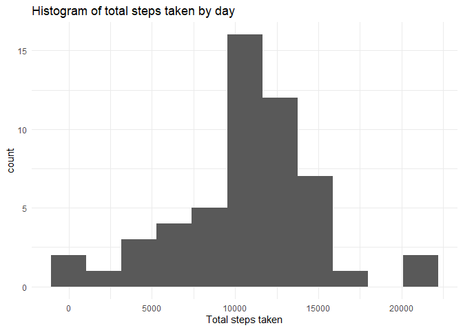
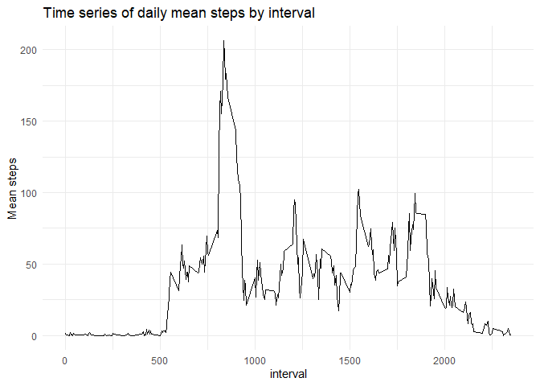
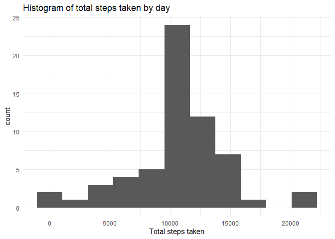
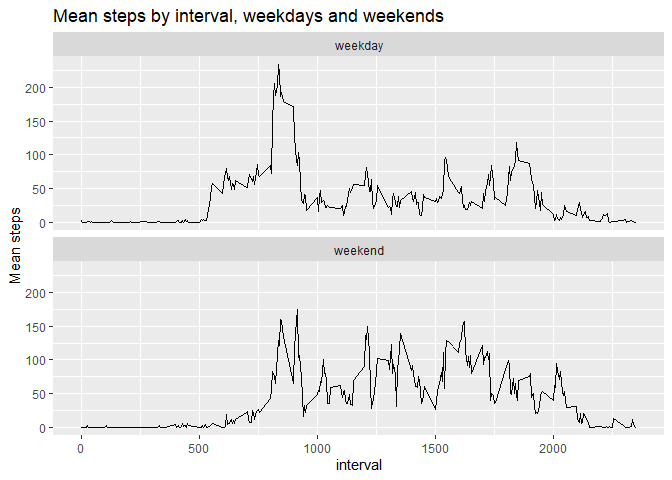

# Introduction

This document contains the code and reusult analysis required for week 2 assignment of the Reproducible Research course, from data science specialization.  

It is required to answer a series of questions, using the data set provided. This dataset contains data collected from a personal activity monitoring device that collects data at 5 minute intervals through out the day. The data consists of two months of data from an anonymous individual collected during the months of October and November, 2012 and include the number of steps taken in 5 minute intervals each day.  

# Loading and preprocessing the data  

Downloads and unzips data  


```r
library(tidyverse)
```

```
## -- Attaching packages -------------------------------------------------------------------- tidyverse 1.3.0 --
```

```
## v ggplot2 3.2.1     v purrr   0.3.3
## v tibble  2.1.3     v dplyr   0.8.3
## v tidyr   1.0.0     v stringr 1.4.0
## v readr   1.3.1     v forcats 0.4.0
```

```
## -- Conflicts ----------------------------------------------------------------------- tidyverse_conflicts() --
## x dplyr::filter() masks stats::filter()
## x dplyr::lag()    masks stats::lag()
```

```r
library(ggplot2)

##download and unzip data

file.url <- "https://d396qusza40orc.cloudfront.net/repdata%2Fdata%2Factivity.zip"
download.file(file.url, destfile = paste0(getwd(),"/data.zip"))
unzip(paste0(getwd(),"/data.zip"))
```

Loads data from csv

```r
#reads the data file
dataset <- as_tibble(read.csv(paste0(getwd(),"/activity.csv"), stringsAsFactors = FALSE))
#changes date character column to date class
dataset <- dataset %>%
  mutate(date = as.Date(date))
```

# What is mean total number of steps taken per day?

Calculate the sum of steps taken each day in a data frame


```r
plot1.data <- dataset %>%
  group_by(date) %>%
  summarise(steps_taken = sum(steps)) %>%
  filter(is.na(steps_taken) == FALSE)
```
Plots histogram


```r
ggplot(data = plot1.data, aes(steps_taken)) +
  geom_histogram(bins = 11)+
  ggtitle("Histogram of total steps taken by day")+
  xlab("Total steps taken")+
  theme_minimal()
```

<!-- -->

## Mean and median number of steps taken each day  

Using the totals calculated for the histogram, calculates mean and median


```r
paste("Total steps mean:", round(mean(plot1.data$steps_taken)))
```

```
## [1] "Total steps mean: 10766"
```

```r
paste("Total steps median:", round(median(plot1.data$steps_taken)))
```

```
## [1] "Total steps median: 10765"
```


# What is the average daily activity pattern?  

## Time series plot of the average number of steps taken  

Calculates mean of steps taken by interval, stores in a data frame  

```r
plot2.data <- dataset %>%
  filter(is.na(steps) == FALSE) %>%
  group_by(interval) %>%
  summarise(mean_steps = mean(steps)) %>%
  arrange(interval)
```

Plots time series (line plot)

```r
ggplot(plot2.data, aes(x = interval, y = mean_steps))+
  geom_line()+
  ggtitle("Time series of daily mean steps by interval")+
  ylab("Mean steps")+
  theme_minimal()
```

<!-- -->

## Which 5-minute interval, on average across all the days in the dataset, contains the maximum number of steps?  

Arrange the data used to plot time series by the calculated mean, and retrieves the interval of the first record


```r
max.steps.interval <- plot2.data %>%
  arrange(desc(mean_steps))
max.steps.interval <- max.steps.interval$interval[1]
print(max.steps.interval)
```

```
## [1] 835
```

# Imputing missing values

## Code to describe and show a strategy for imputing missing data  

The missing data will be replaced with the interval mean.

The means will be calculated and stored in a data frame, and a for loop will check the dataset and when finds a NA, will check the means dataset end fill it; The means will also be rounded to integers once steps is a discrete variable

A new data frame named filled.dataset will contain the filled values:


```r
filled.dataset <- dataset
interval.means <- dataset %>%
  filter(is.na(steps) == FALSE) %>%
  group_by(interval) %>%
  summarise(mean_steps = round(mean(steps)))

for (row in 1:nrow(filled.dataset)) {
  if(is.na(filled.dataset[row,1]) == FALSE) {
    next()
  }
  interval.id <- filled.dataset[row,3][[1]]
  interval.mean <- (filter(interval.means, interval == interval.id))[[2]]
  filled.dataset[row,1] <- interval.mean
}
```

## Histogram of the total number of steps taken each day after missing values are imputed  

Calculate the sum of steps taken each day in a data frame, after NAs replaced


```r
plot3.data <- filled.dataset %>%
  group_by(date) %>%
  summarise(steps_taken = sum(steps)) %>%
  filter(is.na(steps_taken) == FALSE)
```
Plots histogram


```r
ggplot(data = plot3.data, aes(steps_taken)) +
  geom_histogram(bins = 11)+
  ggtitle("Histogram of total steps taken by day")+
  xlab("Total steps taken")+
  theme_minimal()
```

<!-- -->

## Differences of mean and median of imputed data and original data


```
## [1] "Imputed data total steps mean: 10766"
```

```
## [1] "Imputed data total steps median: 10762"
```
The only diference noticed is that the median of the imputed data reduced from 10765 to 10762  

# Are there differences in activity patterns between weekdays and weekends?  

Create a new variable (wd_we) for weekday or weekend, then calculates mean of steps taken by interval  


```r
plot4.data <- dataset %>%
  mutate(wd_we = weekdays(date)) %>%
  mutate(wd_we = ifelse(wd_we %in% c("sábado","domingo"), "weekend","weekday")) %>%
  filter(is.na(steps) == FALSE) %>%
  group_by(wd_we,interval) %>%
  summarise(mean_steps = mean(steps))
```

Plots time series  


```r
ggplot(plot4.data , aes(x = interval , y = mean_steps)) + 
  geom_line() + 
  facet_wrap(~wd_we , ncol = 1, nrow=2)+
  ggtitle("Mean steps by interval, weekdays and weekends")+
  ylab("Mean steps")
```

<!-- -->
